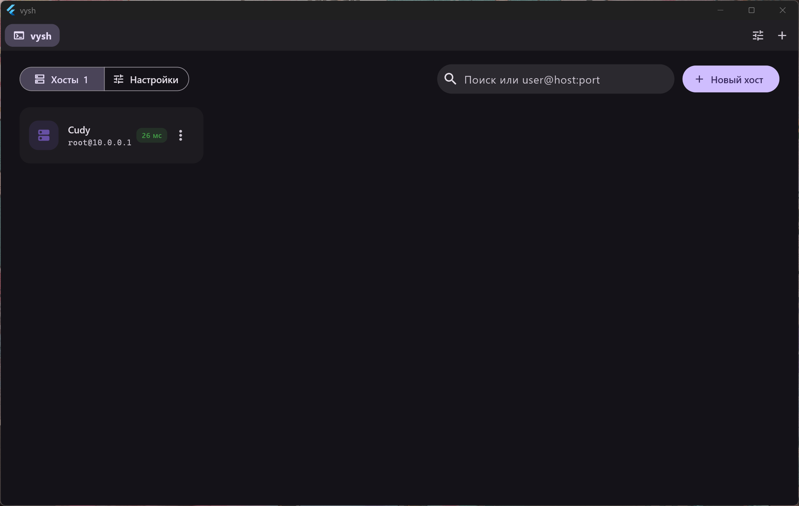

<div align="center">

# vysh

**Минималистичный и красивый SSH-менеджер для Windows и Linux**


[Скачать](../../releases/latest) · [Возможности](#возможности) · [Горячие клавиши](#горячие-клавиши) · [Сборка](#сборка-из-исходников) · [Архитектура](docs/ARCHITECTURE.md)

</div>

<p align="center"></p>

---

## Возможности

### 🖥 Хосты и вкладки
- Карточки серверов с группами, цветными метками и поиском
- Быстрое подключение: набери `user@host:port` в поиске и нажми Enter
- Индикатор доступности хоста (отключается в настройках — для продовых серверов)
- Вкладки с перетаскиванием, дублированием и статусом соединения

### ⌨️ Терминал
- Полноценный эмулятор: `htop`, `mc`, `vim`, 256 цветов и truecolor, мышь
- Копирование при выделении, вставка правым кликом / средней кнопкой / `Ctrl+V` — как удобно
- Подтверждение перед вставкой нескольких строк — защита от случайного запуска команд
- Переподключение по Enter после обрыва

### 🔐 Подключение
- Пароль, ключ (OpenSSH, с парольной фразой), стандартные ключи из `~/.ssh`
- keyboard-interactive: PAM, одноразовые коды
- Проверка ключа сервера: предупреждение при первом подключении и при смене ключа
- Пароли — в системном хранилище: DPAPI на Windows, Secret Service (gnome-keyring / KWallet) на Linux

### 📁 SFTP
- Панель файлов рядом с терминалом поверх того же соединения
- Перетаскивание файлов и папок из проводника для загрузки
- Скачивание файлов и папок, очередь передач с прогрессом и скоростью
- Двойной клик — открыть файл в локальном редакторе, при сохранении он сам зальётся обратно
- Переименование, удаление, права доступа (`chmod`), новые папки

### 🩺 Диагностика
- Экран ошибки подключения с понятным объяснением и подробным журналом
- Пинг, трассировка и проверка порта прямо из приложения

### 🎨 Внешний вид
- Material 3 / Material You, светлая и тёмная темы, 9 акцентных цветов
- Тема терминала подстраивается под акцент
- Обычное окно без хаков: корректно ведёт себя в Hyprland, sway, KDE, GNOME и Windows

## Установка

### Windows
1. Скачайте `vysh-<версия>-windows-x64.zip` со страницы [релизов](../../releases/latest)
2. Распакуйте в любую папку и запустите `vysh.exe`

> При первом запуске Windows SmartScreen может предупредить о неизвестном издателе:
> «Подробнее» → «Выполнить в любом случае».

### Linux
```sh
mkdir -p ~/.local/opt/vysh
tar -xzf vysh-<версия>-linux-x64.tar.gz -C ~/.local/opt/vysh
~/.local/opt/vysh/vysh
```
Нужны `libgtk-3` и `libsecret-1` — в дистрибутивах с графическим окружением они обычно уже есть.

### Обновление
Удалите папку со старой версией и распакуйте новую. Хосты, настройки и пароли хранятся отдельно и никуда не денутся.

## Где хранятся данные

| | Windows | Linux |
|---|---|---|
| Хосты, настройки, `known_hosts.json` | `%APPDATA%\vysh` | `~/.config/vysh` |
| Пароли и парольные фразы | DPAPI (привязаны к учётной записи) | Secret Service (gnome-keyring, KWallet, KeePassXC) |

Файлы с хостами и настройками — обычный JSON без секретов: их можно хранить в git или синхронизировать через Syncthing.

## Горячие клавиши

| Действие | Клавиши |
|---|---|
| Новая вкладка / быстрое подключение | `Ctrl+Shift+T` |
| Закрыть вкладку | `Ctrl+Shift+W` |
| Следующая / предыдущая вкладка | `Ctrl+Tab` / `Ctrl+Shift+Tab` |
| Вкладка по номеру (1 — главная) | `Alt+1…9` |
| Новый хост | `Ctrl+Shift+N` |
| Переподключить | `Ctrl+Shift+R` |
| Панель файлов (SFTP) | `Ctrl+Shift+E` |
| Копировать / вставить | `Ctrl+Shift+C` / `Ctrl+Shift+V` |
| Настройки | `Ctrl+,` |

Все сочетания с `Shift`, чтобы не отбирать у терминала `Ctrl+W`, `Ctrl+R` и прочие.

## Сборка из исходников

Нужны [Flutter](https://docs.flutter.dev/get-started/install) (stable), а для Windows — Visual Studio 2022 с компонентами «Desktop development with C++» и «C++ ATL».

```sh
git clone <этот репозиторий> && cd vysh
flutter pub get
flutter run -d windows   # или: -d linux
```

Релизная сборка для Windows одним скриптом:
```powershell
powershell -ExecutionPolicy Bypass -File tools\build-windows.ps1
# → dist\vysh-<версия>-windows-x64.zip
```

Для Linux дополнительно: `ninja-build libgtk-3-dev libsecret-1-dev`, затем `flutter build linux --release`.

### Релизы
Сборки делает GitHub Actions: тег `vX.Y.Z` → Windows-zip и Linux-архив в [Releases](../../releases).
```sh
git tag v0.2.0 && git push origin v0.2.0
```

## Стек

[Flutter](https://flutter.dev) · [Riverpod](https://riverpod.dev) · [dartssh2](https://pub.dev/packages/dartssh2) (SSH и SFTP) · [xterm2](https://pub.dev/packages/xterm2) (терминал) · [flutter_secure_storage](https://pub.dev/packages/flutter_secure_storage)

Подробности — в [docs/ARCHITECTURE.md](docs/ARCHITECTURE.md).

## Планы

- [x] Хосты, вкладки, терминал
- [x] Пароли и ключи, проверка ключа сервера
- [x] SFTP с очередью передач
- [x] Диагностика подключения
- [ ] Цвета из системы и дотов: акцент Windows, pywal, matugen, caelestia — с обновлением на лету
- [ ] Свой заголовок окна с вкладками (Windows / GNOME / KDE)
- [ ] AppImage, .deb, AUR, установщик для Windows, поддержка отечественных дистрибутивов
- [ ] Сниппеты, проброс портов, jump host, разделение вкладки на панели
- [ ] ssh-agent / Pageant, хранилище с мастер-паролем
