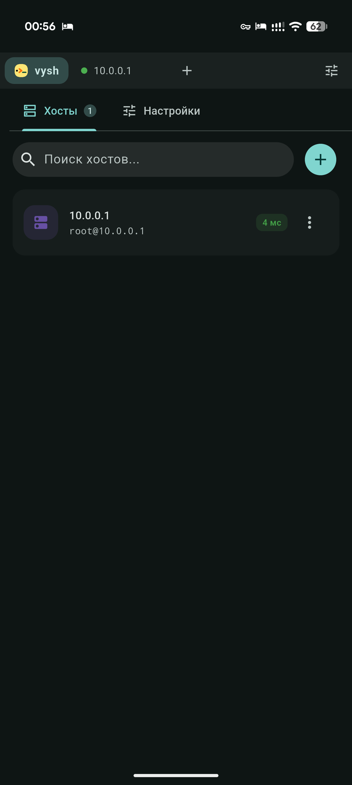

<div align="center">


# vysh-apk

**Минималистичный и быстрый SSH-клиент для Android на базе Flutter**

[](https://flutter.dev)
[](https://dart.dev)
[](https://android.com)
[](#установка)
[](https://m3.material.io)

[Скачать APK](../../releases/latest) · [Возможности](#возможности) · [Установка](#установка) · [Сборка](#сборка-из-исходников) · [Благодарности](#credits)

</div>

<p align="center">
  
</p>

---

## О проекте

vysh-apk — это адаптация десктопного SSH-менеджера vysh для мобильных устройств под управлением Android. Приложение сочетает полноценный терминал, встроенный SFTP-клиент и интерфейс в стиле Material You с динамическими системными цветами.

---

## Возможности

- **Хосты и сессии**: группировка, цветовые метки, быстрый коннект через поисковую строку (`user@host:port`), пинг доступности и работа с несколькими вкладками параллельно.
- **Терминал**: поддержка `htop`, `mc`, `vim`, 256 цветов и truecolor; дополнительная строка функциональных клавиш над клавиатурой (Ctrl, Esc, стрелки, Tab); защита от случайной вставки многострочных команд; история вывода до 1 млн строк.
- **Аутентификация**: пароли, ключи OpenSSH (включая защищённые парольной фразой), keyboard-interactive (2FA/PAM); проверка отпечатков хостов (Host Key Verification).
- **Встроенный SFTP**: двухпанельная работа с файлами, загрузка в системную папку «Загрузки» без лишних разрешений (через MediaStore), очередь передачи данных, открытие и автообновление файлов через внешние редакторы.
- **Интеграция с Android**: полная поддержка динамической палитры Monet (Material You), тематическая иконка, фоновая работа сессий без разрывов и безопасное хранение учетных данных в Android Keystore.
- **Оптимизация**: рендеринг через Skia для минимального потребления оперативной памяти и заряда аккумулятора.

---

## Установка

Готовые установочные пакеты доступны на странице [релизов](../../releases/latest):

1. Скачайте APK-файл нужной архитектуры:
   - `vysh.<версия>.arm64-v8a.apk` — для большинства современных устройств (64-bit).
   - `vysh.<версия>.armeabi-v7a.apk` — для более старых 32-битных устройств.
2. Установите APK, разрешив установку из внешних источников при первом открытии.
3. При необходимости длительных фоновых сессий отключите оптимизацию батареи для приложения по запросу в интерфейсе.

Для обновления просто установите новый APK поверх текущего — все хосты, ключи и настройки сохранятся.

---

## Хранение данных

| Данные | Расположение |
|---|---|
| Профили хостов, настройки, `known_hosts.json` | Внутреннее изолированное хранилище приложения |
| Пароли и секретные ключи | Android Keystore |
| Загрузки через SFTP | Общедоступная системная папка `Download` (MediaStore) |

---

## Сборка из исходников

Для сборки требуется настроенный [Flutter SDK](https://docs.flutter.dev/get-started/install) (stable-канал) и Android SDK:

```bash
git clone https://github.com/Gitveu/vysh-apk.git
cd vysh-apk
flutter pub get
```

Сборка релизных APK с разделением по архитектурам:

```bash
flutter build apk --split-per-abi --release \
  --dart-define="BUILD_DATE=$(date '+%d.%m.%y %H:%M:%S')"
```

Файлы сборки будут находиться в каталоге `build/app/outputs/flutter-apk/`.

---

## Стек технологий

- [Flutter](https://flutter.dev) & [Dart](https://dart.dev)
- [Riverpod](https://riverpod.dev) — управление состоянием
- [dartssh2](https://pub.dev/packages/dartssh2) — SSHv2 и SFTP-протоколы
- [xterm2](https://pub.dev/packages/xterm2) — эмуляция терминала
- [flutter_secure_storage](https://pub.dev/packages/flutter_secure_storage) — работа с Keystore

---

## Credits

- Оригинальный проект и десктопная версия: [vyto4ka/vysh](https://github.com/vyto4ka/vysh)
- Портирование и адаптация под Android: [Gitveu/vysh-apk](https://github.com/Gitveu/vysh-apk) 
